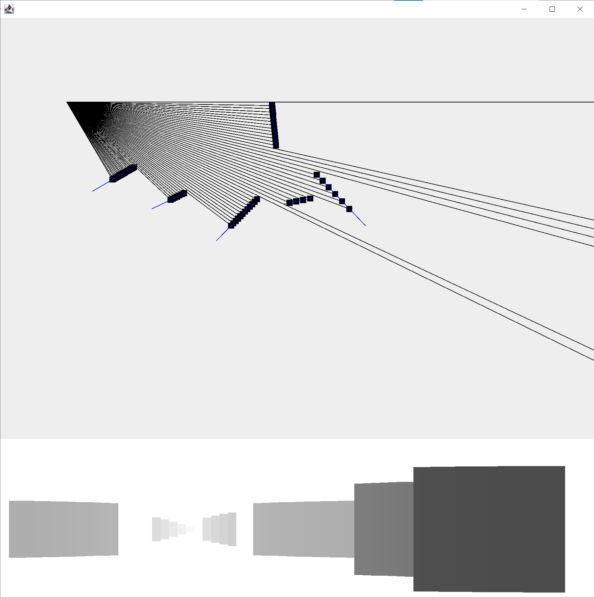

# 2D Ray Casting Implementation
This is a simple 2D implementation of ray casting in Java. Note the setup of this program. Controls use WASD for movement, and QE for rotation. The 3D preview is shown at the bottom of the screen, while the two-dimensional ray casting is controlled and viewed from the top window.

